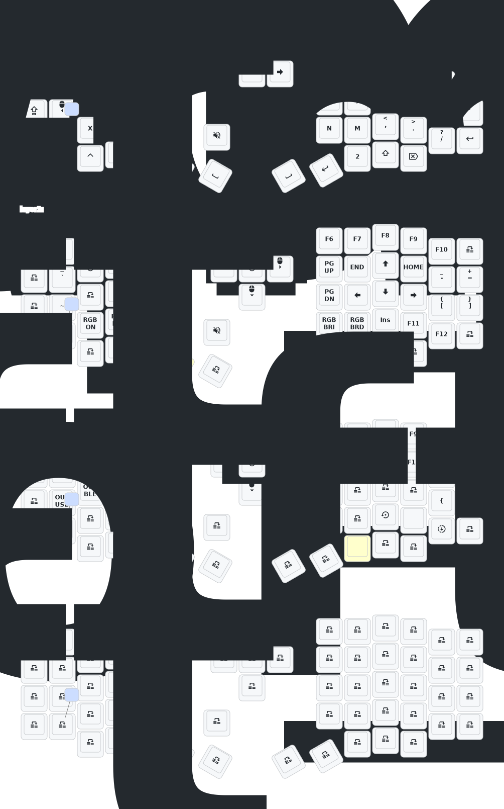

# Paul Sofle

## Update List
- 20 Sept 2025
  1. Used (Keymap Editor)[https://nickcoutsos.github.io/keymap-editor/] to change the layout to match my settings. This publishes here to GitHub
- 8 May 2025
  1. Updated keyboard layout with Keymap Editor page
   

- 2024/12/21
  1. Added support for zmk-studio (just refresh the left hand to use).
- 2024/10/24
  1. Modified power supply mode to reduce power consumption.
  2. Fixed the automatic shut-off feature for RGB power supply.

> If your keyboard was updated before October 24, please update to the latest firmware.
> 
---
## Contact Me

For 3D printed model files or any issues and malfunctions with the keyboard, please contact 380465425@qq.com

## Previous Sofle Keymap

was located at keymap-drawer/sofle.svg

